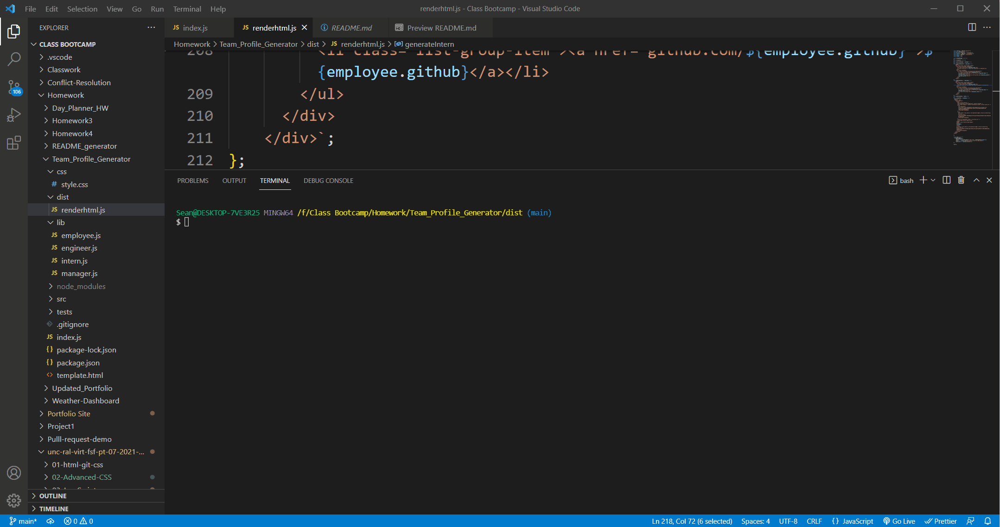

# Team Generator

 - [Demo](#demo)
 - [Description](#description)
 - [Installation](#installation)
 - [Usage](#usage)
 - [Additional Info](#additional-info)

    ## Demo:
    

    ## Description:
    This application is designed to take input from a CLI and use that to create an HTML file which lists a team with a single manager and as many engineers or interns as the user wishes to add. The full team is listed with some basic info for each teeam member on the html page that is created. 

    ## Installation:
    To install, simply copy the contents of this repository into a folder. Once in that folder, install the necessary required npm package (inquirer) by typing "npm i" in the command line. 

    ## Usage:
    To start the application, navigate to the folder through a terminal window and run "index.js". The terminal will display questions for the user to answer. After the manager has been added, it will continue to ask questions for the employees which can be either engineers or interns. After each engineer or intern, it will ask the user if they want to add another employee and repeat the process. Once the user is done, they will answer "no" and an index.html file will be created which can be viewed with all of the created team members displayed on the page. 

    ## Additional Info:
    - Github: [Mctastic](https://github.com/mctastic)
    - Email: mctastic2121@gmail.com 